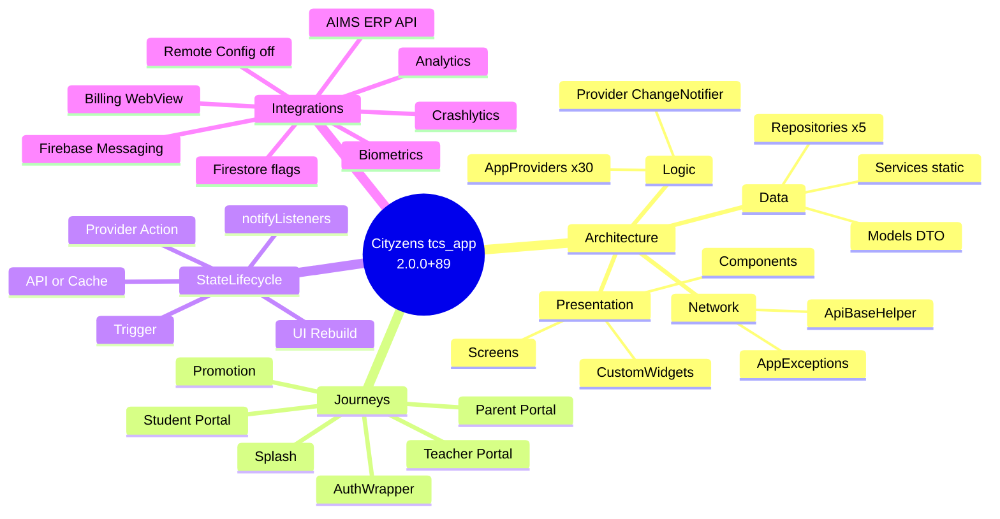

# Mind Map Overview

> Back to [[Home]] · [[Diagrams/Index|Diagrams]]

```mermaid
mindmap
  root((Cityzens tcs_app<br/>2.0.0+89))
    Architecture
      Presentation
        Screens
        Components
        CustomWidgets
      Logic
        Provider ChangeNotifier
        AppProviders x30
      Data
        Services static
        Repositories x5
        Models DTO
      Network
        ApiBaseHelper
        AppExceptions
    Journeys
      Splash
      Promotion
      AuthWrapper
      Student Portal
      Teacher Portal
      Parent Portal
    StateLifecycle
      Trigger
      Provider Action
      API or Cache
      notifyListeners
      UI Rebuild
    Integrations
      Firebase Messaging
      Crashlytics
      Analytics
      Firestore flags
      Remote Config off
      AIMS ERP API
      Billing WebView
      Biometrics
```
